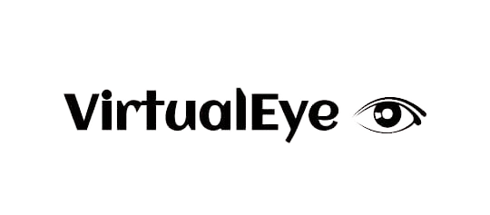
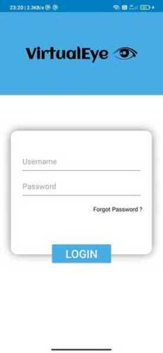
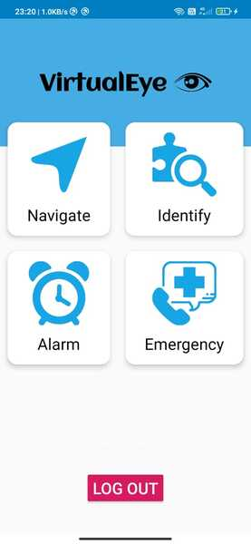

# **Virtual Assist**

## Virtual Assistant for guiding visually challenged people. 





## Screenshots
 &nbsp;&nbsp;&nbsp;&nbsp;&nbsp;&nbsp;&nbsp;&nbsp;&nbsp; 

## Demo
[Video](https://drive.google.com/file/d/1KhbZ9nU5-TDA17Aq5kfO_y3K8eF6Xab6/view?usp=sharing)


## Getting Started

_Follow these instructions to build and run the project._

1. Clone this repository.
```bash
  git clone https://github.com/infyhwi2021/Team13/tree/master
```
2. Download the appropriate [JDK](http://www.oracle.com/technetwork/java/javase/downloads/jdk8-downloads-2133151.html)
for your system. We are currently on JDK 8.
3. [Install Android Studio](https://developer.android.com/sdk/index.html).
4. Import the project. Open Android Studio, click `Open an existing Android
   Studio project` and select the project. Gradle will build the project.
5. Run the app. Click `Run > Run 'app'`. After the project builds you'll be
   prompted to build or launch an emulator.


## Features

- Object Detection with warning
- Voice assistant
- Navigation using map
- Alarm system for emergency


## Future Scope

- Biometric authentication
- Distance detection using noise
- Audio and Gesture recognition   

## Feedback

If you have any feedback, please reach out to us at advayaggarwal0301@gmail.com


## Tech Stack

**Client:** XML

**Tools:** Android Studio

**Server:** Tensorflow Lite, Java

## Authors

- [@AdarshPanigrahi](https://www.github.com/AdarshPanigrahi)
- [@advayaggarwal](https://www.github.com/advayaggarwal)
- [@ritikrai](https://www.github.com/ritikrai)
- [@ujjwal-ab](https://www.github.com/ujjwal-ab)


## References

 - [Dataset](https://cocodataset.org/#home)
 - [Deep Learning on Android](https://www.tensorflow.org/lite/guide/android)
 - [Object Detection Model](https://www.tensorflow.org/lite/examples/object_detection/overview)

  
